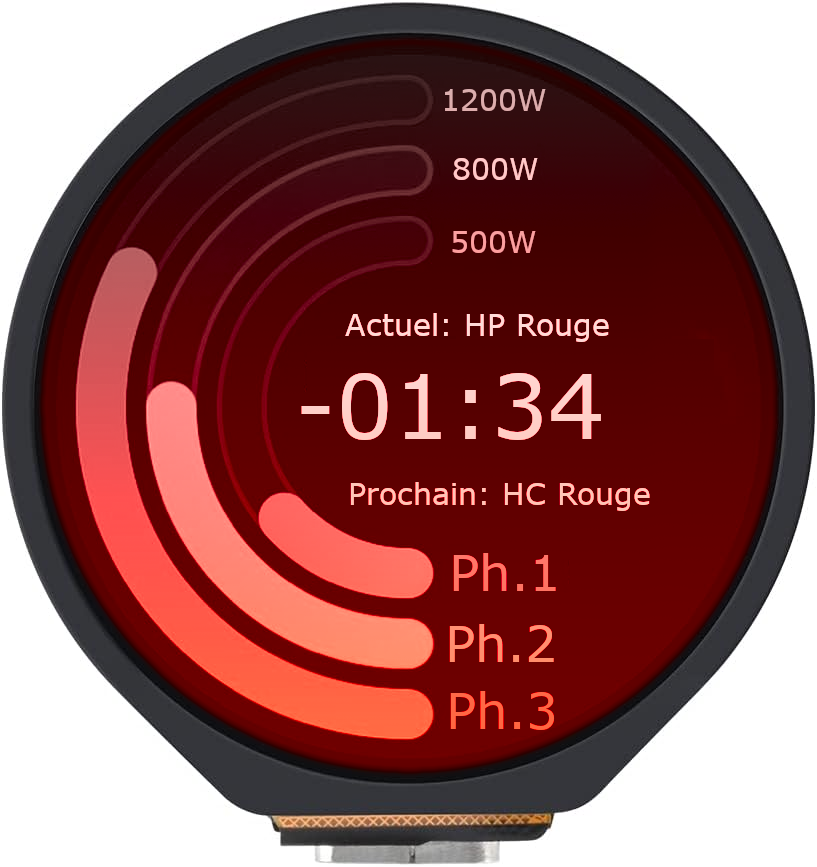
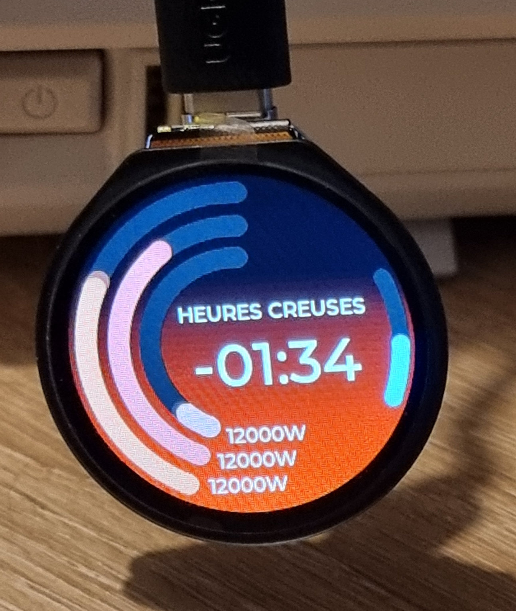

Tempo-screen
====================
A project to setup the [waveshare ESP32-S3 round touch 1.28" LCD](https://www.waveshare.com/wiki/ESP32-S3-Touch-LCD-1.28) as a monitor for EDF Tempo rate.

The project uses the ESP-IDF SDK and LVGL for rendering.

### Mockups

Display showing off-peak blue hours, and next rate is on-peak white.


Display showing off-peak red hours, and next rate is on-peak white.


Display showing off-peak blue hours, and next rate is on-peak red.


Display showing on-peak red hours, and next rate is off-peak red.



### Picture from device



### How to run on target from VSCode

Add in .vscode/settings.json:
```
{
    "idf.flashType": "UART",
    "idf.portWin": "COM6", // replace with actual COM port
    "idf.adapterTargetName": "esp32s3", // replace with actual device
    ... // Rest of settings.json
}
```